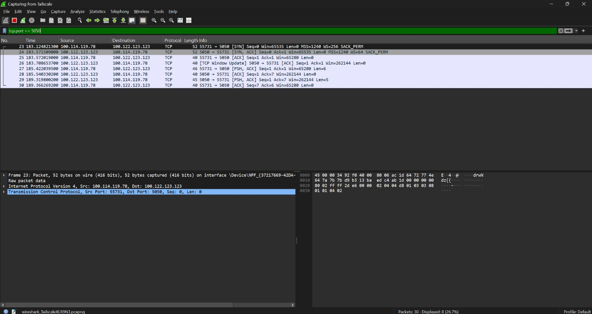
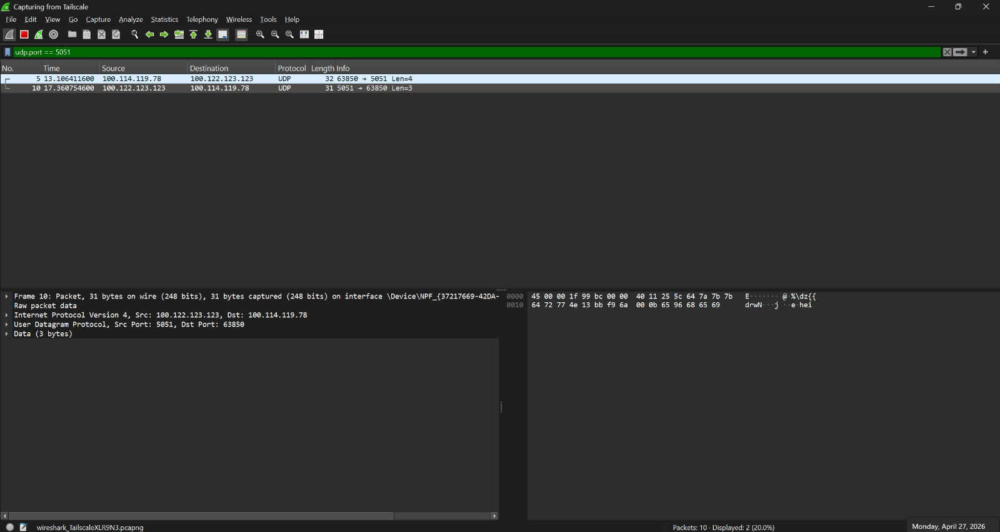

# Sockets assignment

This repository contains simple TCP and UDP chat servers for the assignment.

## Packet capture screenshots

Below are two placeholder screenshots you should add to this repository (create an `images/` folder and place the files there):

- `images/tcp_capture.png` — screenshot of a TCP session capture (Wireshark) showing the TCP handshake and message exchange between client and server.
- `images/udp_capture.png` — screenshot of a UDP session capture (Wireshark) showing the first packet from the client (so the server learns the client address) and subsequent exchanges.

## How to capture

1. Start Wireshark (or tcpdump) and filter for the port used in this assignment, e.g. `udp.port == 5050` or `tcp.port == 5050`.
2. Run the appropriate client and server (TCP server first, client sends first message; UDP server will learn the client address from the first packet).
3. Save screenshots from Wireshark showing the relevant frames and place them in `images/tcp_capture.png` and `images/udp_capture.png`.

## Notes

- Keep the images under 2–3 MB each to keep the repository size reasonable. If you prefer, use JPG for smaller files.
- If you upload the screenshots here I can embed them directly in the README for you.

## Screenshots (embedded)

Below are the embedded screenshots. They will display here after you place the PNG files into the `images/` folder with the exact names.

